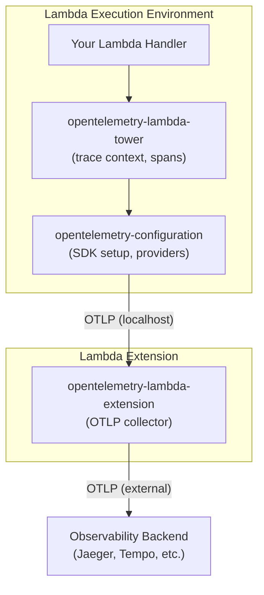
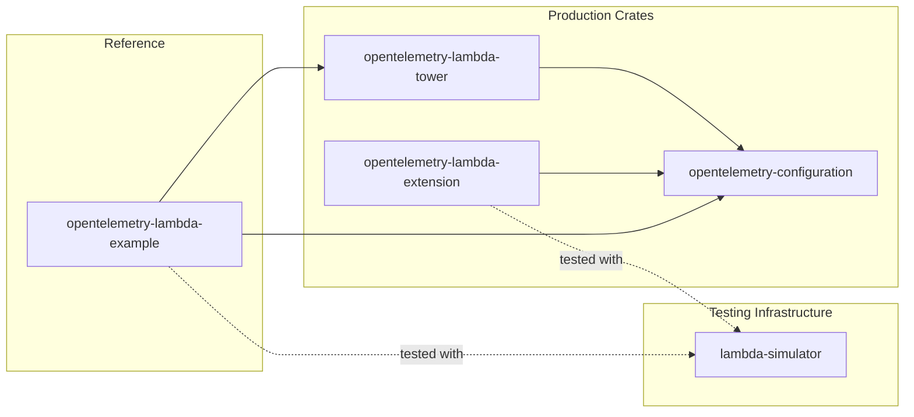
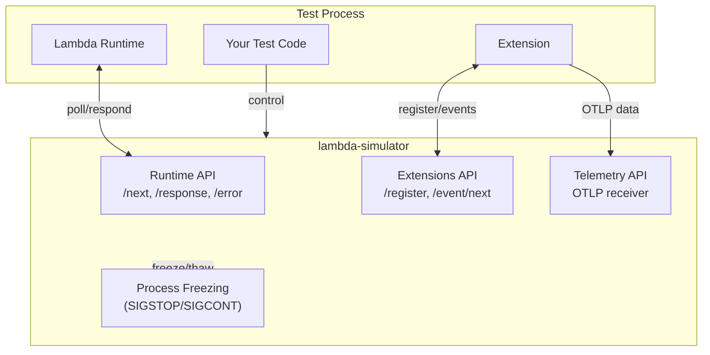

# Lambda Observability

A comprehensive suite of Rust crates for AWS Lambda observability with OpenTelemetry.

## Overview

This workspace provides production-ready tools for instrumenting, testing, and collecting telemetry from AWS Lambda functions:

| Crate | Description |
|-------|-------------|
| [lambda-simulator](crates/lambda-simulator/) | High-fidelity Lambda Runtime/Extensions/Telemetry API simulator for local testing |
| [opentelemetry-configuration](crates/opentelemetry-configuration/) | Opinionated OTel SDK setup with layered configuration and drop-based lifecycle |
| [opentelemetry-lambda-tower](crates/opentelemetry-lambda-tower/) | Tower middleware for automatic Lambda handler instrumentation |
| [opentelemetry-lambda-extension](crates/opentelemetry-lambda-extension/) | Deployable Lambda extension for OTLP telemetry collection |
| [opentelemetry-lambda-example](crates/opentelemetry-lambda-example/) | Reference implementations demonstrating usage |

## Quick Start

### Instrumenting a Lambda Function

```rust
use opentelemetry_configuration::{OtelSdkBuilder, OtelGuard};
use opentelemetry_lambda_tower::{OtelTracingLayer, ApiGatewayV2Extractor};
use lambda_runtime::{run, LambdaEvent};
use tower::ServiceBuilder;

#[tokio::main]
async fn main() -> Result<(), lambda_runtime::Error> {
    // Initialise OpenTelemetry with automatic configuration
    let guard = OtelSdkBuilder::new()
        .with_standard_env()
        .service_name("my-lambda")
        .build()?;

    // Create instrumented service with Tower middleware
    let service = ServiceBuilder::new()
        .layer(
            OtelTracingLayer::builder(ApiGatewayV2Extractor::new())
                .flush_on_end(true)
                .build()
        )
        .service_fn(handler);

    run(service).await
}

async fn handler(
    event: LambdaEvent<serde_json::Value>,
) -> Result<serde_json::Value, lambda_runtime::Error> {
    Ok(serde_json::json!({"message": "Hello!"}))
}
```

### Testing with the Simulator

```rust
use lambda_simulator::{SimulatorBuilder, FreezeMode};

#[tokio::test]
async fn test_lambda_invocation() {
    let simulator = SimulatorBuilder::new()
        .freeze_mode(FreezeMode::Notify)
        .build()
        .await
        .unwrap();

    // Spawn your runtime process or use in-process testing
    let response = simulator
        .invoke(serde_json::json!({"name": "test"}))
        .await
        .unwrap();

    assert!(response.status().is_success());
}
```

## Architecture

### Production Data Flow



### Crate Relationships



### Testing Architecture



## Features

- **High-fidelity Lambda simulation** for local testing with process freezing (SIGSTOP/SIGCONT)
- **Automatic trace context propagation** (W3C traceparent, X-Ray)
- **Drop-based lifecycle management** - automatic flush and shutdown
- **Batch processing support** with span links for SQS/SNS
- **Event-driven testing primitives** - no flaky sleep-based synchronisation
- **Layered configuration** - defaults, files, environment variables

## Configuration

OpenTelemetry settings can be configured through multiple sources (in order of precedence):

1. **Environment variables** (`OTEL_*` prefix)
2. **Config file** (`/var/task/otel-config.toml` in Lambda)
3. **Sensible defaults** (localhost:4318 for HTTP OTLP)

Example environment variables:
```bash
OTEL_EXPORTER_OTLP_ENDPOINT=http://collector:4318
OTEL_SERVICE_NAME=my-lambda
OTEL_TRACES_SAMPLER=always_on
```

## Development

```bash
# Run all tests
cargo test --workspace

# Run tests with all features
cargo test --workspace --all-features

# Check formatting and lints
cargo fmt --check
cargo clippy --workspace -- -D warnings

# Build documentation
cargo doc --workspace --no-deps --open
```

## Minimum Supported Rust Version

This project requires Rust 1.91.1 or later.

## Licence

Licensed under either of:

- Apache Licence, Version 2.0 ([LICENCE-APACHE](LICENCE-APACHE) or http://www.apache.org/licenses/LICENSE-2.0)
- MIT licence ([LICENCE-MIT](LICENCE-MIT) or http://opensource.org/licenses/MIT)

at your option.
