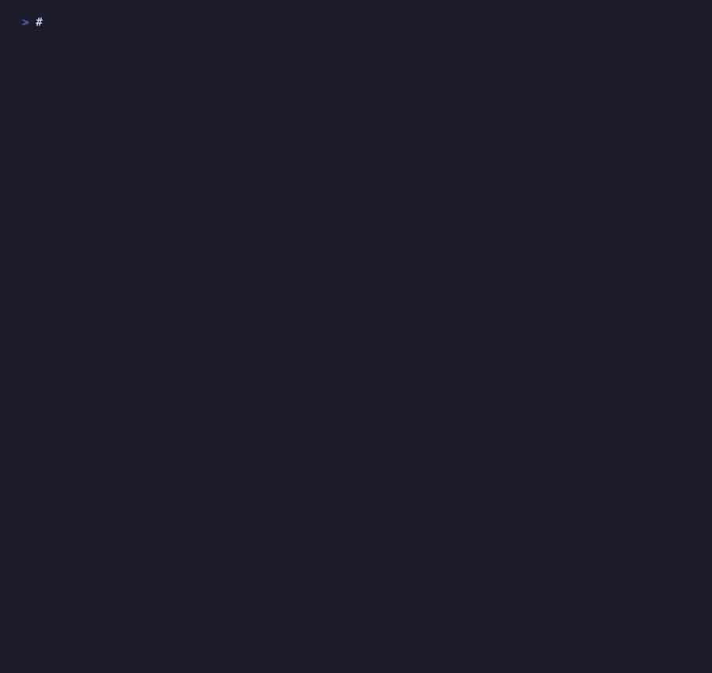

# lambda-simulator

High-fidelity AWS Lambda Runtime API simulator for testing Lambda runtimes and extensions locally.



## Overview

This crate provides a simulator that implements the AWS Lambda Runtime API, Extensions API, and Telemetry API, allowing you to test Lambda runtimes and extensions without deploying to AWS. It's particularly useful for:

- Testing Lambda extensions (OpenTelemetry collectors, custom extensions)
- Developing custom Lambda runtimes
- Integration testing Lambda handlers with extensions
- Validating telemetry pipelines locally

## Features

- **Runtime API** - Full implementation of the Lambda Runtime Interface (`/runtime/invocation/next`, response/error endpoints)
- **Extensions API** - Extension registration, lifecycle events (INVOKE, SHUTDOWN)
- **Telemetry API** - Platform telemetry subscription and event delivery
- **Process Freezing** - Simulates Lambda's freeze/thaw behaviour using SIGSTOP/SIGCONT (Unix only)
- **Event-Driven Testing** - Efficient wait helpers that eliminate flaky sleep-based synchronisation
- **In-Memory Telemetry Capture** - Capture and assert on telemetry events without HTTP servers

## Installation

```toml
[dev-dependencies]
lambda-simulator = "0.1"
```

## Quick Start

```rust
use lambda_simulator::{Simulator, InvocationBuilder};
use serde_json::json;

#[tokio::main]
async fn main() -> Result<(), Box<dyn std::error::Error>> {
    // Create a simulator
    let simulator = Simulator::builder()
        .function_name("my-test-function")
        .build()
        .await?;

    // Get the Runtime API URL for your runtime
    let runtime_api = simulator.runtime_api_url();
    println!("Runtime API available at: {}", runtime_api);

    // Enqueue an invocation
    simulator.enqueue_payload(json!({
        "message": "Hello, Lambda!"
    })).await;

    // Your runtime connects to runtime_api and processes the invocation
    Ok(())
}
```

## Testing Lambda Runtimes

The simulator provides efficient, event-driven wait helpers:

```rust
use lambda_simulator::{Simulator, InvocationStatus};
use serde_json::json;
use std::time::Duration;

#[tokio::test]
async fn test_my_runtime() {
    let simulator = Simulator::builder()
        .function_name("test-function")
        .build()
        .await
        .unwrap();

    // Set the runtime API URL for your runtime
    std::env::set_var("AWS_LAMBDA_RUNTIME_API", simulator.runtime_api_url());

    // Enqueue returns the request ID for tracking
    let request_id = simulator.enqueue_payload(json!({"key": "value"})).await;

    // Start your runtime in a background task
    // tokio::spawn(async { my_runtime::run().await });

    // Wait for completion with timeout - no polling loops needed
    let state = simulator
        .wait_for_invocation_complete(&request_id, Duration::from_secs(5))
        .await
        .expect("Invocation should complete");

    assert_eq!(state.status, InvocationStatus::Success);
}
```

## Testing Extensions

```rust
use lambda_simulator::Simulator;
use std::time::Duration;

#[tokio::test]
async fn test_extension_registration() {
    let simulator = Simulator::builder().build().await.unwrap();

    // Start your extension pointing at the simulator
    std::env::set_var("AWS_LAMBDA_RUNTIME_API", simulator.runtime_api_url());
    // tokio::spawn(async { my_extension::run().await });

    // Wait for extension to register
    simulator.wait_for(
        || async { simulator.extension_count().await >= 1 },
        Duration::from_secs(5)
    ).await.unwrap();

    // Verify registration
    let extensions = simulator.registered_extensions().await;
    assert_eq!(extensions.len(), 1);
}
```

## Telemetry Capture

Capture telemetry events in memory for assertions:

```rust
use lambda_simulator::Simulator;
use serde_json::json;

#[tokio::test]
async fn test_telemetry_events() {
    let simulator = Simulator::builder().build().await.unwrap();

    // Enable in-memory capture
    simulator.enable_telemetry_capture().await;

    // Process invocations...
    simulator.enqueue_payload(json!({"test": "data"})).await;

    // Assert on captured events
    let events = simulator.get_telemetry_events_by_type("platform.initStart").await;
    assert!(!events.is_empty());
}
```

## Process Freezing (Unix Only)

Simulate Lambda's freeze/thaw behaviour:

```rust
use lambda_simulator::{Simulator, FreezeMode};

let simulator = Simulator::builder()
    .freeze_mode(FreezeMode::Enabled)
    .build()
    .await?;

// Register PIDs to freeze between invocations
simulator.register_pid_for_freeze(extension_pid).await;

// Processes are frozen after invocation completes
// and unfrozen when the next invocation arrives
```

## API Coverage

### Runtime API

| Endpoint | Status |
|----------|--------|
| `GET /runtime/invocation/next` | ✅ |
| `POST /runtime/invocation/{id}/response` | ✅ |
| `POST /runtime/invocation/{id}/error` | ✅ |
| `POST /runtime/init/error` | ✅ |

### Extensions API

| Endpoint | Status |
|----------|--------|
| `POST /extension/register` | ✅ |
| `GET /extension/event/next` | ✅ |
| `POST /extension/init/error` | ✅ |
| `POST /extension/exit/error` | ✅ |

### Telemetry API

| Endpoint | Status |
|----------|--------|
| `PUT /telemetry` | ✅ |

## Platform Support

| Feature | Linux | macOS | Windows |
|---------|-------|-------|---------|
| Runtime API | ✅ | ✅ | ✅ |
| Extensions API | ✅ | ✅ | ✅ |
| Telemetry API | ✅ | ✅ | ✅ |
| Process Freezing | ✅ | ✅ | ❌ |

Process freezing uses POSIX signals (SIGSTOP/SIGCONT) and is not available on Windows.

## Licence

Apache-2.0
